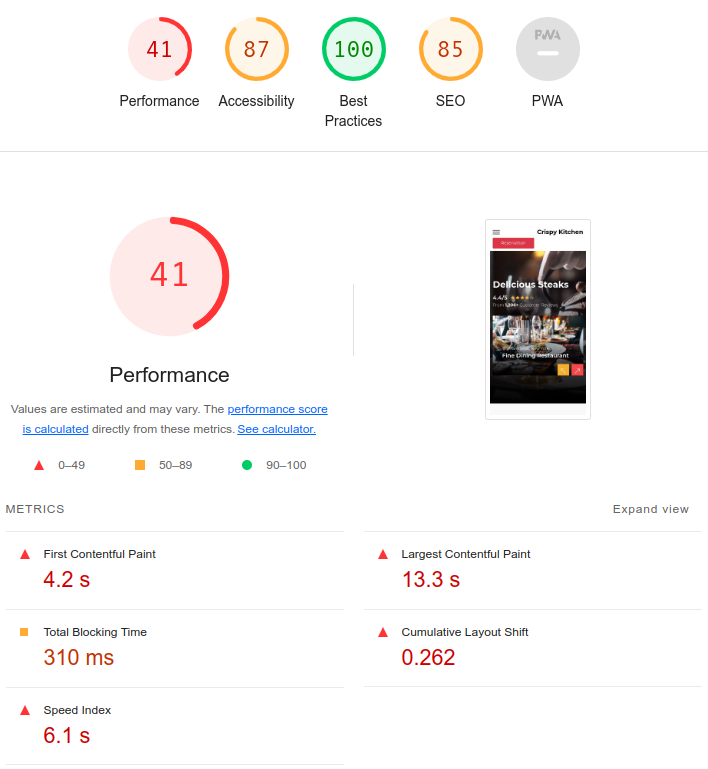
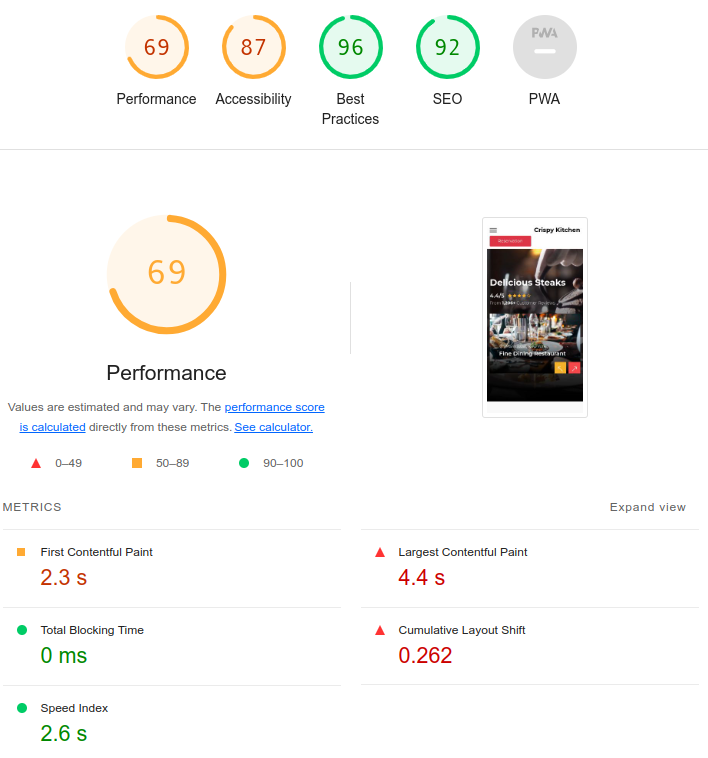

# Second Assigment

* Fixed type error in `about.html` line 233 extra < character

## Optimizations

* Added bundler
* Added bundle analyse
* Added Lighthouse to build step
* Addd Lazy loading to images
* Compressed video with command 

```shell
ffmpeg -i production_ID_3769033.mp4 -vcodec libx264 -crf 25 production_ID_3769033_tmp.mp4
```

**Before Bundler**



**After Bundler and Lazy loading**



### Build and serve

to build
```shell
npm run build
```

to run the builded server
```shell
npm serve dist
```

### Local HTTPS

install `mkcert`, then:

```shell
mkcert -install
```

if the folowing step gives error, consider deleting the files **localhost-key.pem** and **localhost.pem** in this repository

```shell
mkcert localhost
```

## PM2

To run the app with `pm2`, build the app, install `mp2` then use the config file in the repo:

```shell
npm run build
npm install pm2@latest -g
# or yarn global add pm2
pm2 start ecosystem.config.cjs
```

to see the **status** of the clusters:
```shell
pm2 status
```

to **stop** them
```shell
pm2 stop all
```

and to **delete** them:
```shell
pm2 delete all
```

## Deployed App

Check the [application deployed in verce](https://webperf-practice-2-8t6htk4og-mjason98s-projects.vercel.app/)